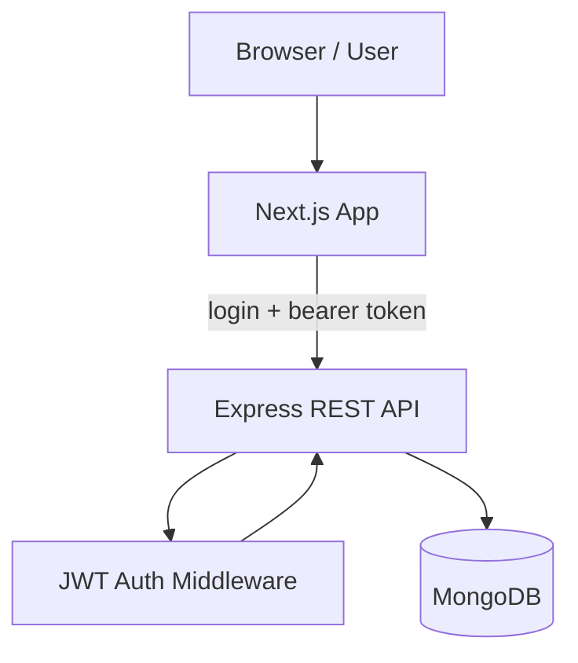
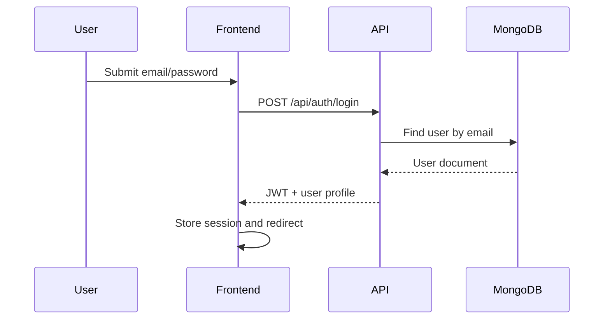
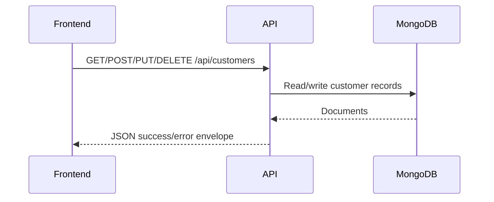
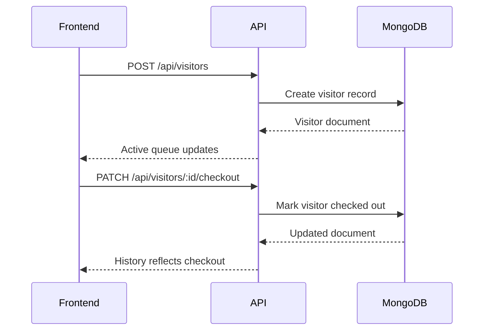

# Architecture

## Overview

Mini Visitor CRM uses a split frontend/backend architecture:

- The Next.js frontend manages authentication state, protected navigation, forms, tables, search, pagination, and visual feedback.
- The Express backend exposes REST APIs for auth, customers, visitors, and dashboard stats.
- MongoDB stores users, customers, and visitor records.

## System Diagram

## Frontend Architecture

### Route Layer

- `/login` handles authentication.
- `/dashboard` shows summary metrics and activity.
- `/customers` provides customer CRUD.
- `/visitors` provides check-in, history, checkout, search, and pagination.

### Shared Client Layer

- `lib/api.ts` centralizes fetch logic and JWT injection.
- `services/*` wraps backend endpoints.
- `providers/AuthProvider.tsx` persists the signed-in user and token.
- `providers/ToastProvider.tsx` handles UI notifications.
- `components/ui/*` exposes reusable UI primitives.

### State Flow

1. User signs in on the login page.
2. The backend returns a JWT and user profile.
3. The frontend stores the session in `localStorage`.
4. Protected routes read the session and redirect unauthenticated users.
5. Client pages load data through the service layer with the bearer token.

## Backend Architecture

### API Modules

- `auth.controller.js` handles login.
- `customer.controller.js` handles CRUD and paginated search.
- `visitor.controller.js` handles check-in, history, and checkout.
- `dashboard.controller.js` computes summary stats.

### Middleware

- `auth.middleware.js` validates JWTs.
- `error.middleware.js` normalizes API failures.

### Validation

- Express validators enforce required fields, email format, and phone number format.

## Data Model

### User

- Admin identity for authentication.

### Customer

- Stores contact details and active/inactive status.

### Visitor

- Stores check-in/out timestamps and meeting context.

## Request Flow Examples

### Login

### Customer CRUD

### Visitor Flow

## Deployment Notes

- Frontend can be deployed to Vercel or Netlify.
- Backend can be deployed to a Node hosting platform or containerized using the included Docker setup.
- The frontend expects `NEXT_PUBLIC_API_URL` to point to the live backend.