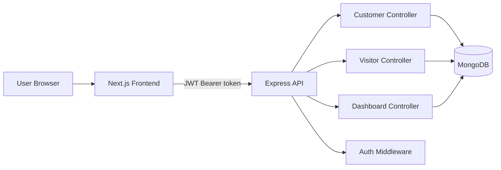

# Mini Visitor CRM System

Mini Visitor CRM is a full-stack assignment project built with Next.js, React, Tailwind CSS, Node.js, Express, and MongoDB. It covers login, protected routes, customer CRUD, visitor check-in/history, dashboard stats, and a responsive UI with backend integration.

## Features

- Email/password login with protected dashboard routes.
- Customer CRUD: add, list, search, edit, and delete.
- Visitor workflows: check-in, history, and checkout.
- Dashboard summary cards and trend chart.
- Pagination, search, error states, loading skeletons, toasts.
- Responsive sidebar, navbar, and reusable design system.
- Bonus: QR code generation, Docker setup, improved UI polish.

## Tech Stack

- Frontend: Next.js 16, React 19, Tailwind CSS 4
- Backend: Node.js, Express
- Database: MongoDB with Mongoose
- Auth: JWT

## Project Structure

- `client/` - Next.js frontend
- `server/` - Express API
- `ARCHITECTURE.md` - System architecture and flow
- `docker-compose.yml` - Local container setup

## Setup

### Prerequisites

- Node.js 20+
- MongoDB connection string

### Backend

```bash
cd server
npm install
```

Create a `.env` file in `server/`:

```env
PORT=5000
MONGODB_URI=mongodb://127.0.0.1:27017/mini-visitor-crm
JWT_SECRET=your_super_secret_key
```

Run the backend:

```bash
npm run dev
```

### Frontend

```bash
cd client
npm install
```

Create a `.env.local` file in `client/`:

```env
NEXT_PUBLIC_API_URL=http://localhost:5000/api
```

Run the frontend:

```bash
npm run dev
```

## Demo Login

The app expects the admin user created by the backend seed script.

- Email: `admin@crm.com`
- Password: use the seeded admin password from `server/src/seedAdmin.js`

## API Endpoints

### Auth

- `POST /api/auth/login`

### Customers

- `GET /api/customers?page=1&limit=10&search=foo`
- `POST /api/customers`
- `GET /api/customers/:id`
- `PUT /api/customers/:id`
- `DELETE /api/customers/:id`

### Visitors

- `GET /api/visitors?page=1&limit=10&search=foo`
- `POST /api/visitors`
- `GET /api/visitors/history?page=1&limit=10&search=foo`
- `GET /api/visitors/:id`
- `PATCH /api/visitors/:id/checkout`

### Dashboard

- `GET /api/dashboard/stats`

## Data Schema

### User

- `name`
- `email`
- `password`
- `role`

### Customer

- `name`
- `email`
- `phone`
- `company`
- `status` (`Active` | `Inactive`)

### Visitor

- `visitorName`
- `phone`
- `personToMeet`
- `purpose`
- `checkInTime`
- `checkOutTime`
- `isCheckedOut`

## Architecture Overview



See [ARCHITECTURE.md](ARCHITECTURE.md) for a deeper explanation.

## Docker

The repo includes a root `docker-compose.yml` plus per-service Dockerfiles for local containerized runs.

```bash
docker compose up --build
```

## Deployment

The frontend is ready for Vercel or Netlify deployment. Set `NEXT_PUBLIC_API_URL` to the deployed backend API URL.

## Notes

- The assignment requirements are implemented in the app.
- Pagination, search, validation, protected routes, and backend integration are all wired.
- The QR code bonus is shown in the visitor history/check-in UI.